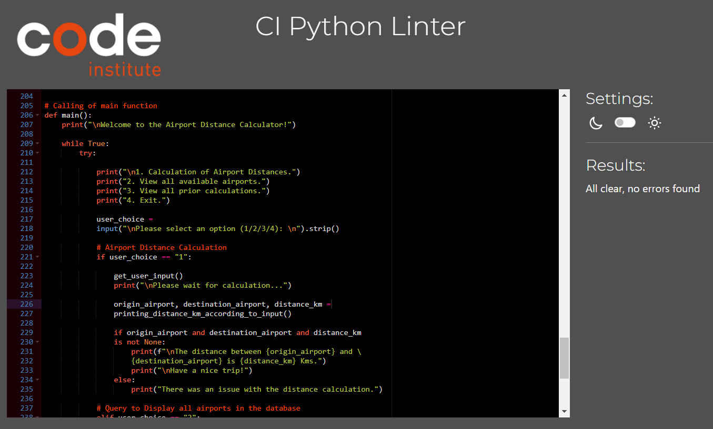
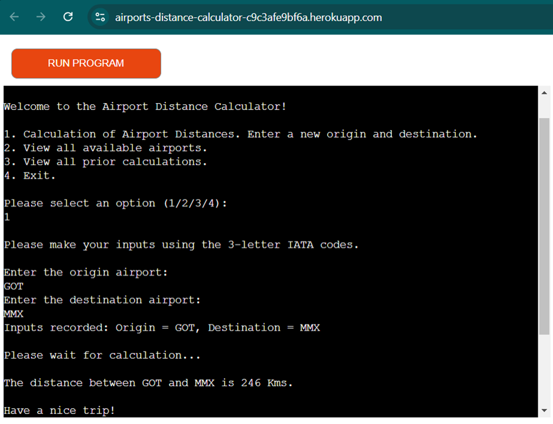
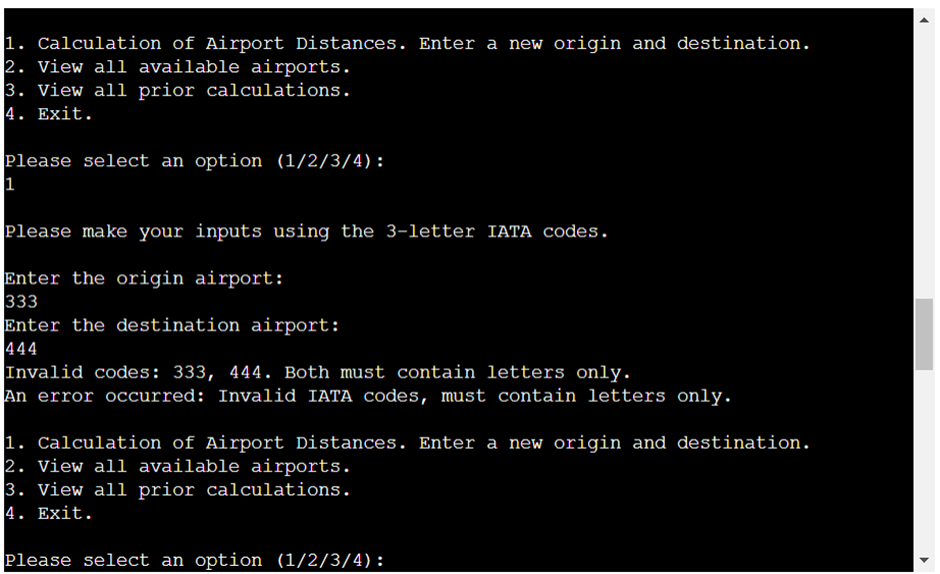
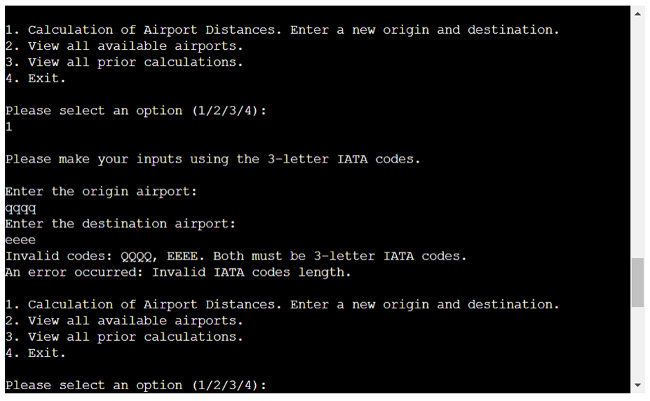
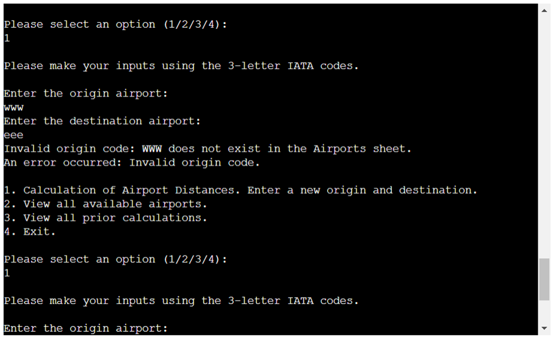
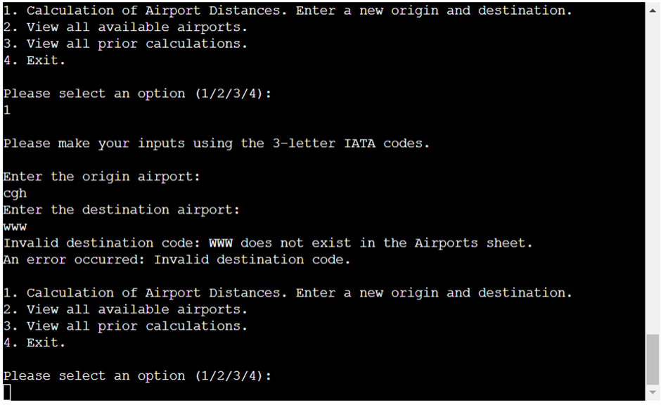
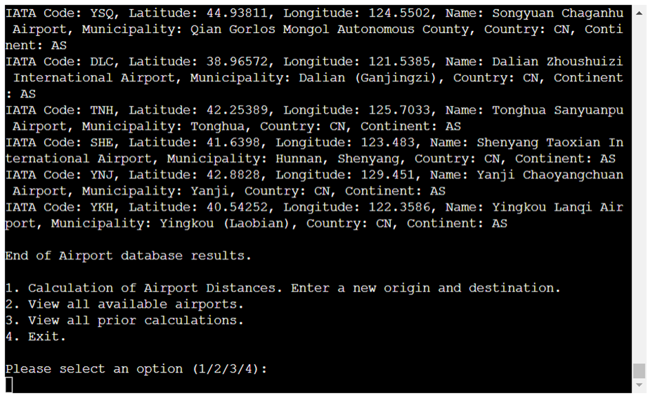
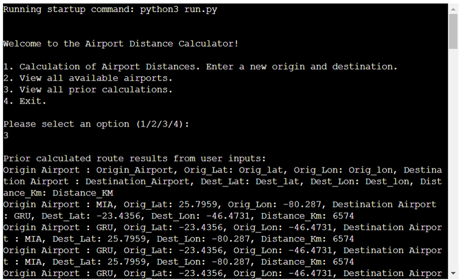
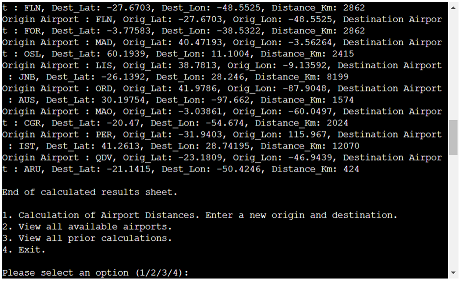
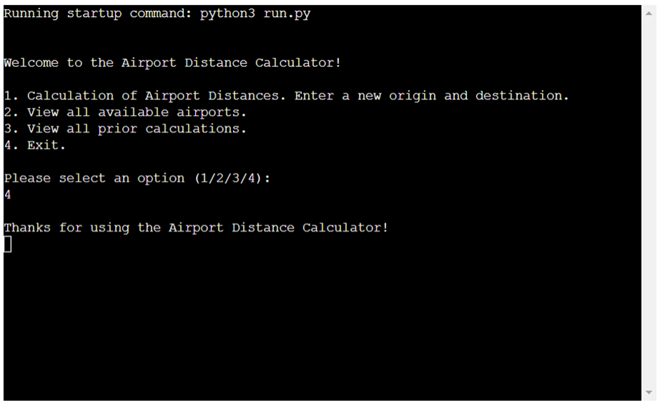

Program designed to comply with Project 03 of Code Institute's Full Stack Developer Course, by Guilherme Brito, in December of 2024.

## Airport Distance Calculator

Was designed with the first flight planning task in mind, finding the distance between two airports, in Kilometers.

## Features

- Existing:

The interface is a python command prompt where the user can inputs its Origin and Destination. This option is the Option 1 in the Menu.

The program then, using the Great Circle Distance method, calculates the direct shortest distance between the two coordinate points. (from Ed Williams Aviation Formulary)

The inputs must be in the Aviation standard, following 3-letter codes for airports. There is a database for all commercial airports in the world, from OurAirports project.

The program has validations to ensure input quality and error handling.

If the user wants to check the airport database there is an prompt for it, the option number 2.

Also, the user can also access the log of prior inputs and calculations, by choosing option 3 in the prompt.

The program ends when the user opts to exit it by option 4 in the prompt.

-Future Ideas:

Program can be enhanced with more calculations like heading between airports, flights times, etc.

## Data Model

Application data is stored in Google Drive and Sheets. Accessed by the program via API.

There are three worksheets:

- user_input: to record the user inputs
- airports: used as a database with all World airports and its coordinates
- results: used to store the distance calculations given the two airport inputs.

## Testing

- Passed the code through a PEP8 linter and confirmed there are no problems.

- Manual testing looking for errors by doing the following tests in the local and Heroku terminal:

  - Good Inputs results

  - Testing for wrong user inputs – numbers instead of letters

  - Testing for wrong user inputs – Inputs with characters longer than 3 characters

  - Testing for invalid Airport Inputs

  - Valid origin and invalid destination

  - Testing all the records in the airports database

  - View all prior calculations

  - View all prior calculations – end of page

  - Exit option

## Deployment

This project was deployed using Code Institute's mock terminal for Heroku.

Steps for deployment:

   - Cloning of Github repository
   - Creation of Heroku App
   - Set the buildbacks to Python and NodeJS, in this order
   - Link of Heroku app to the repositoty
   - Click on deploy

## Credits

- Code Institute for the love-hamburgers template and Heroku terminal. Available at: https://github.com/Code-Institute-Org/p3-template
- Ed Williams Aviation Formulary for the formula to calculate Distance between coordinates. Available at: https://edwilliams.org/avform147.htm
- OurAirports for the wordwide Airport Database. Available at: https://ourairports.com/data/
- Python documentation, for error handling assistance. Available at: https://docs.python.org/3/tutorial/errors.html
- OpenAI ChatGPT for code and refactoring assistance. Available in: https://openai.com/index/chatgpt/
- Google Cloud APIs, Google Drive and Google Sheets. Available at: https://console.cloud.google.com/
---

